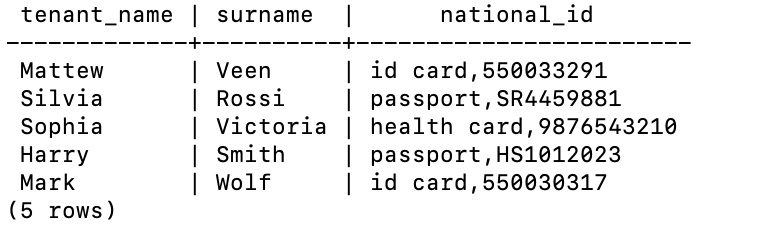
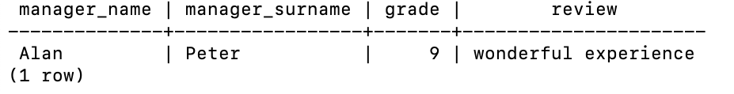

# co-living-DB

## Overview
A co-living is a residential community living model that accommodates people living in the same dwelling unit, facilitated by a professional host. Co-living contributes to a lifestyle concentrated around an international community that provides shared housing for people with similar values or intentions.
While people can create co-living situations on their own, businesses that facilitate the relationship provide some benefits. The main one is that they remove the burdens of doing it on your own, such as negotiating your own contract, furnishing the place and setting up utilities, Wi-Fi and other services. Co-living businesses take care of all of these factors and make it easy to move right in.
Running a co-living business is similar to a hotel business in some ways, such as providing great service. In order to do that, the management team needs to have access to an easy-to-use tool to supervise their co-living business.

We develop a database capable of storing all the informations needed to manage a co-living and to experience a great co-living experience.
A full documentation of the conceptual and logical design of the database can be found in the [docs](docs) folder, as well as the physical implementation of the database in the [src](src) folder.
 
## ER Schema
The image below shows the ER schema of the database.
<p align="center">
    
</p>

## Relational Schema
The image below shows the relational schema of the database.
<p align="center">
    
</p>

A full documentation of the conceptual and logical design of the database can be found in the [docs](docs) folder.


## Physical Implementation and main queries
The sql implementation of the database can be found in the [src](src) folder, together with a simple example of how to populate the database with some data.

Some examples of queries are the following:

1. Retrieve a list of the tenants staying in the co-living in ’Via Gaetano Trezza,18,Verona,37129,Verona,Italy’, together with their name, surname, national ID
```sql
SELECT t.tenant ̇name , t.surname , t.national ̇id
FROM co ̇living.tenant as t
INNER JOIN co ̇living.contract as c ON t.tenant ̇id = c.tenant ̇ID
WHERE c.co ̇living ̇address = ’Via Gaetano Trezza,18,Verona,37129,Verona,Italy’;
```

Output:
<p align="left">
    
</p>

2. List the managers of the tenants who have rated a co-living higher than 8, alongside with the grade and the review;
```sql
Select manager ̇name , manager ̇surname , grade , review From co ̇living.Manager AS M
Inner Join (
(Select * From co ̇living.rate Where grade¿8) AS R
Inner Join co ̇living.Contract AS C ON R.tenant ̇id=C.tenant ̇id) As L On M.manager ̇id=L.manager ̇id;
```

Output:
<p align="left">
    
</p>

3. Select which tenant invited a guest in the ’Cooking class’ event.
```sql
SELECT Q.tenant ̇name
FROM
(SELECT * FROM co ̇living.tenant AS T
INNER JOIN (Select * FROM co ̇living.guest AS G
INNER JOIN (select * from co ̇living.guest ̇participation where event ̇name = ’Cooking
class’ ) AS P
ON G.guest ̇id = P.guest ̇id) AS S
ON T.tenant ̇id = S.tenant ̇id) AS Q;
```

Output:
<p align="left">
    
</p>

**Contributors**:

This project is the result of a team work of the following people:

<p align="center">
    
</p>